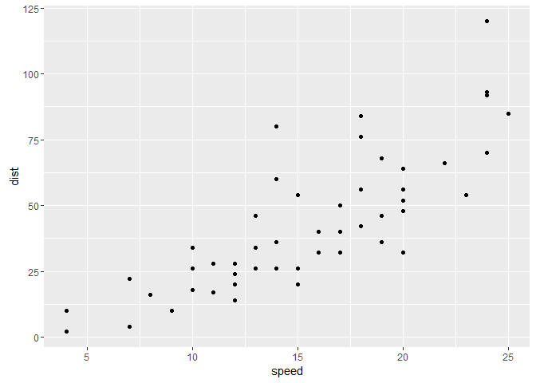

This is an R Markdown document. Markdown is a simple formatting syntax
for authoring HTML, PDF, and MS Word documents. For more details on
using R Markdown see <http://rmarkdown.rstudio.com>.

When you click the **Knit** button a document will be generated that
includes both content as well as the output of any embedded R code
chunks within the document. You can embed an R code chunk like this:

    data(cars)
    library(ggplot2)
    p <- ggplot(cars,aes(speed,dist))
    p + geom_point()

  

    dplyr::filter(cars, speed==4)

    ##   speed dist
    ## 1     4    2
    ## 2     4   10
